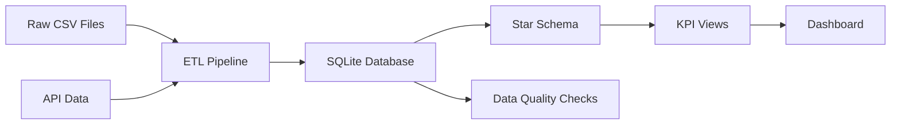

# 📊 E-Commerce Data Warehouse & Analytics Dashboard

> **A complete end-to-end data engineering project showcasing ETL pipelines, dimensional modeling, and interactive analytics**

[](https://your-app.streamlit.app)
[](https://www.python.org/)
[](https://www.sqlite.org/)

---

## 🎯 What This Project Does

This project demonstrates a **complete data warehouse solution** for e-commerce analytics, from raw data ingestion to interactive dashboards. Think of it as a mini version of what companies like Amazon or Flipkart use to analyze their sales data.

- Full-stack data engineering: ETL → Data Modeling → Analytics → Visualization
- Interactive dashboard with filters for deep-dive analysis
- Star schema design following Kimball methodology
- Clean, maintainable, and documented code
- Pre-built KPI views for monthly trends, top products, and category performance
- SQL views for easy querying
- Export capabilities for further analysis

---

## 🚀 Live Demo

**👉 [Try the Live Dashboard](https://your-app.streamlit.app)**


---

## 📁 Project Structure

```
mini-dwh-sql-etl/
│
├── app.py                  # Streamlit dashboard (main interface)
├── etl_pipeline.py         # ETL logic: extract, transform, load
├── queries.sql             # SQL queries for validation & analysis
├── requirements.txt        # Python dependencies
│
├── data/                   # Raw CSV files (auto-generated)
│   ├── orders.csv
│   ├── order_items.csv
│   ├── products.csv
│   └── customers.csv
│
├── assets/                 # Images & documentation
│   └── dashboard_preview.png
│
└── mini_dwh.sqlite        # SQLite database (auto-created)
```

---

## 🏗️ Architecture Overview



### **The Flow:**

1. **📥 Data Sources**
   - CSV files (orders, products, customers)
   - REST API sample data
   - Synthetic data generation for demo

2. **🔄 ETL Pipeline** (`etl_pipeline.py`)
   - **Extract**: Read from CSVs and API
   - **Transform**: Clean, validate, calculate derived fields
   - **Load**: Insert into SQLite database

3. **🗄️ Star Schema Design**
   - **Fact Table**: `fact_sales` (order transactions)
   - **Dimension Tables**: 
     - `dim_customer` (who bought)
     - `dim_product` (what was bought)
     - `dim_date` (when it was bought)

4. **📊 Analytics Layer**
   - Pre-aggregated SQL views for fast querying
   - Data quality monitoring views
   - KPI calculations (revenue, AOV, top products)

5. **🖥️ Dashboard** (`app.py`)
   - Interactive Streamlit interface
   - Filters, charts, and exports
   - Real-time insights

---

## 🛠️ Technologies Used

| Technology | Purpose |
|------------|---------|
| **Python** | Core programming language |
| **Pandas** | Data manipulation and analysis |
| **SQLite** | Lightweight relational database |
| **Streamlit** | Web dashboard framework |
| **SQL** | Data querying and transformations |
| **Requests** | API data fetching |

---

## ⚡ Quick Start

### **Prerequisites**
- Python 3.8 or higher
- pip (Python package manager)

### **Installation**

```bash
# 1. Clone the repository
git clone https://github.com/yourusername/mini-dwh-sql-etl.git
cd mini-dwh-sql-etl

# 2. Install dependencies
pip install -r requirements.txt

# 3. Run the dashboard
streamlit run app.py
```

The dashboard will automatically:
- Generate sample data
- Create the database
- Load the star schema
- Open in your browser at `http://localhost:8501`

---

## 📊 Key Features

### **1. Automated ETL Pipeline**
- ✅ Synthetic data generation with realistic patterns
- ✅ Data cleaning and validation
- ✅ Incremental loading capability
- ✅ Error handling and logging

### **2. Star Schema Data Warehouse**
- ✅ Dimensional modeling best practices
- ✅ Optimized for analytical queries
- ✅ Foreign key relationships enforced
- ✅ Date dimension for time-series analysis

### **3. Data Quality Monitoring**
```sql
-- Built-in DQ checks
- Null value detection
- Negative quantity/price detection
- Revenue calculation validation
- Orphaned record identification
```

### **4. Interactive Dashboard**
- 📈 Monthly revenue and order trends
- 🏆 Top 10 products by revenue
- 🎯 Category performance breakdown
- 🔍 Dynamic filters (date range, category, payment method)
- 📥 CSV export functionality

### **5. Business Insights**
- Average Order Value (AOV) tracking
- Category contribution analysis
- Payment method trends
- Automated insight generation

---

## 📈 Sample Analytics

### **Monthly KPIs**
```
Month    | Orders | Revenue   | AOV
---------|--------|-----------|--------
2024-01  |   89   | $496,490  | $5,578
2024-02  |   72   | $349,324  | $4,852
2024-06  |  109   | $639,607  | $5,868
```

### **Top Product Categories**
```
Category     | Revenue     | % of Total
-------------|-------------|------------
Home         | $1,420,991  | 33.88%
Electronics  | $1,063,868  | 25.36%
Beverages    | $1,032,499  | 24.62%
Snacks       |   $677,019  | 16.14%
```

---

## 🔍 Data Quality Checks

The pipeline includes **automated data quality views**:

```sql
-- Check for missing critical fields
SELECT * FROM dq_nulls;

-- Identify invalid numeric values
SELECT * FROM dq_negative_qty;

-- Validate revenue calculations
SELECT COUNT(*) AS mismatched_revenue
FROM fact_sales
WHERE ABS(revenue - (quantity*unit_price*(1-COALESCE(discount,0)))) > 0.001;
```

---

## 🚀 Deployment

### **Deploy to Streamlit Cloud (Free)**

1. **Push to GitHub**
   ```bash
   git add .
   git commit -m "Initial commit"
   git push origin main
   ```

2. **Deploy on Streamlit Cloud**
   - Go to [share.streamlit.io](https://share.streamlit.io)
   - Click "New app"
   - Select your GitHub repo
   - Set main file: `app.py`
   - Click "Deploy"!

3. **Share Your Public URL**
   - You'll get a URL like: `https://your-app.streamlit.app`
   - Add it to your resume and LinkedIn!

---

## 📚 Learning Outcomes

### **Data Engineering Skills**
- ✅ ETL pipeline design and implementation
- ✅ Dimensional modeling (star schema)
- ✅ Data quality frameworks
- ✅ SQL query optimization

### **Analytics Skills**
- ✅ Business metrics definition (AOV, conversion rates)
- ✅ Time-series analysis
- ✅ Category and product performance analysis
- ✅ Data visualization best practices

### **Software Engineering Skills**
- ✅ Clean, modular code structure
- ✅ Error handling and validation
- ✅ Documentation and README creation
- ✅ Version control with Git
- ✅ Cloud deployment

---

## 🎓 Technical Deep Dive

### **Star Schema Design**

```sql
-- Fact Table: Core transaction data
CREATE TABLE fact_sales (
    order_id INTEGER,
    order_date TEXT,
    customer_id INTEGER,
    product_id INTEGER,
    quantity INTEGER,
    unit_price REAL,
    discount REAL,
    status TEXT,
    payment_method TEXT,
    revenue REAL  -- Calculated: quantity * unit_price * (1 - discount)
);

-- Dimension Table: Product attributes
CREATE TABLE dim_product (
    product_id INTEGER PRIMARY KEY,
    category TEXT,
    subcategory TEXT,
    price REAL
);

-- Additional dimensions: dim_customer, dim_date
```

### **ETL Process**

1. **Extract**: Read raw CSV files
2. **Transform**: 
   - Clean null values
   - Standardize date formats
   - Calculate derived metrics (revenue)
   - Join order headers with line items
3. **Load**: Insert into dimensional tables
4. **Validate**: Run DQ checks

---

## 📫 Contact & Connect

**Your Name**  
📧 Email: your.email@example.com  
💼 LinkedIn: [linkedin.com/in/yourprofile](https://linkedin.com/in/yourprofile)  
🐙 GitHub: [github.com/yourusername](https://github.com/yourusername)  
🌐 Portfolio: [yourportfolio.com](https://yourportfolio.com)

---

## 🤝 Contributing

Found a bug or have a feature idea? Feel free to:
- Open an issue
- Submit a pull request
- Reach out directly

---

## 📄 License

This project is open source and available under the [MIT License](LICENSE).

---

## 🌟 Acknowledgments

- Built to demonstrate data engineering best practices
- Inspired by real-world e-commerce data warehouses
- Uses Streamlit's amazing framework for rapid prototyping

---

## 📸 More Screenshots

### Dashboard Overview


### Category Analysis


### Data Quality Monitoring


---

**⭐ If you found this helpful, please star the repository!**

**📢 Share this with others learning data engineering!**

---